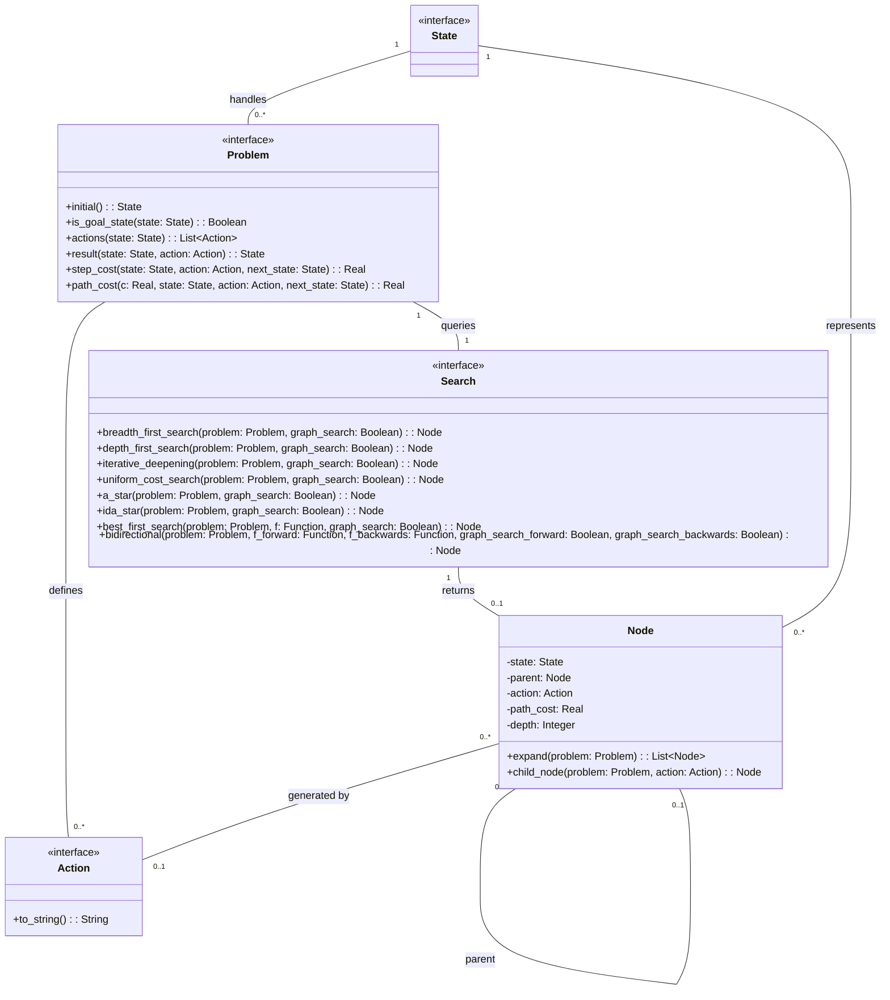

# AI Problem Solver 
An object-oriented C++20 framework for solving classical AI state-space problems using search algorithms (A, BFS, DFS, IDA*) based on Russell &amp; Norvig's AIMA architecture.

